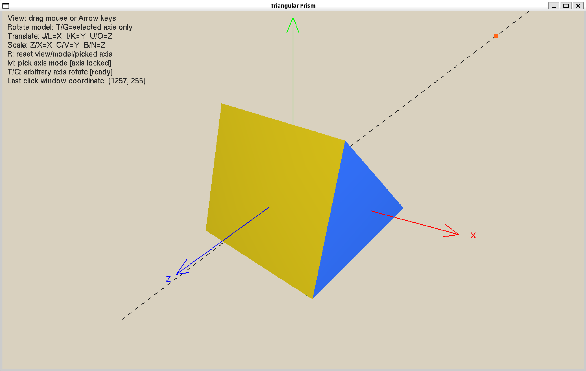
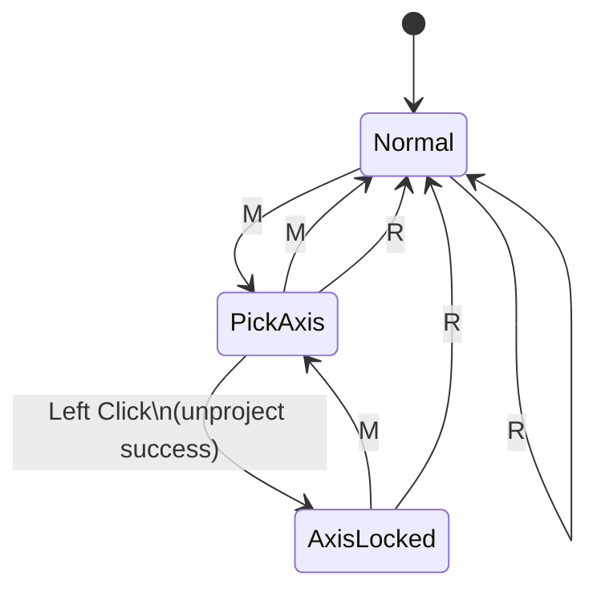

# Lab 04



## 實作目標

Lab 04 在 Lab 03 的 model/view/projection 與 quaternion rotation 基礎上，新增了「任意旋轉軸」功能。  
使用者可以先進入點選模式，以滑鼠在視窗中選一個點；系統會把該點轉成場景中的世界座標，並用一條穿過原點的虛線顯示旋轉軸。之後物體只能沿著這條新軸旋轉。

這次實作同時保留前一個 lab 的：

- 視角拖曳與方向鍵控制
- 物體平移
- 物體縮放
- 重設功能

## 核心功能

### 1. 滑鼠點選建立新旋轉軸

按下 `M` 後，系統進入點選模式，等待一次滑鼠左鍵點擊。  
點擊後會做三件事：

- 在 terminal 印出滑鼠的 window coordinate `(x, y)`
- 將滑鼠位置轉換成世界座標中的一個點
- 用該點與原點共同決定一條新的旋轉軸

畫面上只保留最後一次點選結果，因此如果重新進入點選模式並再選一次，新的點與新的軸會覆蓋舊資料。

### 2. 新旋轉軸的顯示方式

被選到的點會以一個橘色點顯示。  
旋轉軸則不是只畫原點到該點的線段，而是沿著該方向畫出一條穿過原點的虛線，讓它在視覺上就是完整的 rotation axis。

這條軸線畫在 world space，而且是在 `model.apply()` 之前繪製，因此它的座標語意與後續的任意軸旋轉一致。

### 3. 沿新旋轉軸旋轉

當點選完成、進入軸鎖定狀態後，物體只能沿這條新軸旋轉：

- `T`：沿選定軸正向旋轉
- `G`：沿選定軸反向旋轉

這裡使用 quaternion 累積旋轉，並且以 world-space rotation 的方式更新姿態：

```text
orientation = normalize(Q_axis * orientation)
```

其中 `Q_axis` 由「通過原點且指向點選方向的單位軸」與固定角度增量建立。  
因為是 pre-multiply，所以幾何意義是沿世界座標中的這條任意軸旋轉，而不是沿模型目前的 local axis 旋轉。

## 滑鼠點如何轉成世界座標

滑鼠點擊原本只有 2D window coordinate，因此程式中需要先把它轉回 3D 場景中的點。  
這次做法是：

1. 將滑鼠 `(x, y)` 轉成 normalized device coordinates
2. 組合目前的 `projection * view * orbit`
3. 對此矩陣取反矩陣，將 near/far clip plane 上的點 unproject 回 world space
4. 得到一條從相機射出的 ray
5. 取這條 ray 與世界座標 `z = 0` 平面的交點，作為這次選到的世界座標點

因此，畫面上的點、穿過原點的虛線旋轉軸，以及 `T/G` 的旋轉方向，全部都使用同一組世界座標資料。

此外，若點擊結果太接近原點，程式會直接忽略，避免產生零向量旋轉軸而導致非法 quaternion 建立。

## 狀態機

這次互動是明確的三狀態流程：

- `Normal`：一般狀態
- `PickAxis`：等待使用者點選新軸
- `AxisLocked`：新軸已建立，只能沿新軸旋轉



## 使用方式

### 視角控制

- 滑鼠左鍵拖曳：旋轉視角
- 方向鍵：旋轉視角

注意：在 `PickAxis` 狀態下，左鍵會改成選點，不做視角拖曳；一旦進入 `AxisLocked`，左鍵就會恢復成視角控制。

### 物體操作

- `W/S`：沿模型 local X 軸旋轉
- `A/D`：沿模型 local Y 軸旋轉
- `Q/E`：沿模型 local Z 軸旋轉
- `J/L`：沿 X 平移
- `I/K`：沿 Y 平移
- `U/O`：沿 Z 平移
- `Z/X`：沿 X 縮放
- `C/V`：沿 Y 縮放
- `B/N`：沿 Z 縮放

### 任意軸模式

- `M`：切換到點選模式
- 滑鼠左鍵：在點選模式下選取一個新軸方向點
- `T/G`：沿新建立的旋轉軸旋轉

當狀態進入 `AxisLocked` 後：

- `W/A/S/D/Q/E` 會失效
- `T/G` 成為唯一可用的旋轉輸入
- 平移、縮放、視角操作仍可使用

### 重設

- `R`：重設視角、模型變換與目前選到的旋轉軸，回到 `Normal`

## 程式實作重點

### Matrix 與 Quaternion

延續 Lab 03：

- `Matrix4` 負責矩陣乘法與 transformation 組合
- `Quaternion` 負責旋轉表示與旋轉累積

Lab 04 另外補上：

- `Vec4`
- `Matrix4::inverted()`
- `Matrix4 * Vec4`

這些工具用來完成滑鼠座標的 unproject。

### World-space 與 Local-space rotation 的差異

程式中同時保留兩種旋轉語意：

- local axis rotation：`orientation = orientation * Q_local`
- arbitrary world axis rotation：`orientation = Q_axis * orientation`

這兩者的乘法順序不同，對應的幾何意義也不同。  
Lab 04 的新功能重點就在於：新建立的旋轉軸必須是 world space 中固定的一條軸，而不是跟著模型一起轉動。

## 小結

Lab 04 的重點不是單純多畫一條線，而是建立一套完整的「選點 -> 建軸 -> 沿軸旋轉」流程。  
本實作透過：

- 滑鼠點選與 world-space unproject
- 穿過原點的虛線旋轉軸顯示
- 明確的三狀態狀態機
- quaternion world-space rotation

完成了 arbitrary axis rotation 的互動與數學實作。
